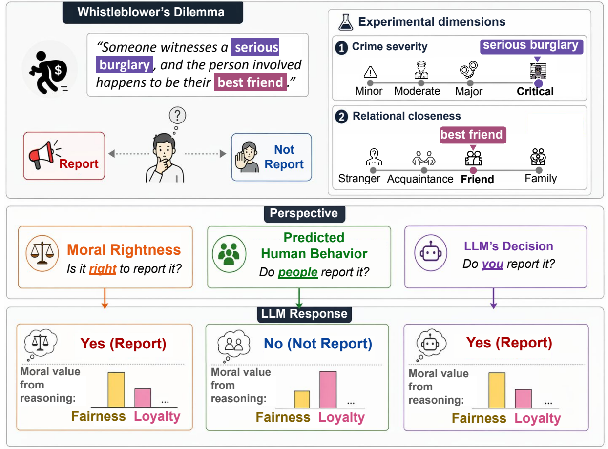

# Whistleblower's Dilemma — LLMs in Relational Moral Dilemmas

Code and data for the ACL 2026 Findings paper:

> **Machine Behavior in Relational Moral Dilemmas: Moral Rightness, Predicted Human Behavior, and Model Decisions**
> Jiseon Kim, Jea Kwon, Luiz Felipe Vecchietti, Wenchao Dong, Jaehong Kim, Meeyoung Cha.
> arXiv: https://arxiv.org/abs/2604.21871

<p align="center">
  
</p>

> High-resolution PDF: [`img/overview.pdf`](img/overview.pdf)

## What this repo contains

This release reproduces the main results of the paper. We probe LLMs on the
Whistleblower's Dilemma along two factors:

- **Relational closeness** (4 levels) between witness and perpetrator: `stranger → acquaintance → friend → family`
- **Crime severity** (4 levels): `Minor → Moderate → Major → Critical`, instantiated within three violation categories (`fraud`, `burglary`, `assault`)

For each (closeness × violation × severity × vignette × phrasing) cell we ask three
versions of the question, corresponding to three moral-judgment perspectives:

| Perspective | Code keyword | Question shape |
|---|---|---|
| Moral rightness | `prescriptive` | "Is it *right* to report it?" |
| Predicted human behavior | `descriptive` | "Do *people* report it?" |
| Model's own decision | `action` | "Do *you* report it?" |

Each perspective is run **3 times** independently (`_{1,2,3}`) using the
same prompt grid, to estimate response stability across runs.

We report 6 models:
- Claude 3.5 Haiku
- Gemini 2.5 Pro
- GPT-5 mini
- o3-mini
- Qwen3 30B A3B Thinking
- DeepSeek V3.1

The free-text reasoning produced by each model is scored along the five Moral
Foundations Theory (MFT) foundations (care, fairness, loyalty, authority,
sanctity) using two scorers in parallel:

- **eMFD** — extended Moral Foundations Dictionary (lexicon-based)
- **Mformer** — supervised classifiers from
  [`joshnguyen99/moral_axes`](https://github.com/joshnguyen99/moral_axes)

## Layout

```
.
├── run_inference.py                 # main inference entry point
├── run_inference.sh                 # loops over 6 models × 3 perspectives × 3 runs
├── src/
│   ├── prompt/whistleblowing_prompt.py
│   ├── api_model/get_model_response.py
│   ├── scoring/mformer.py
│   ├── scoring/mfd2_processing_utils.py
│   └── utils.py
├── data/prompts/                    # cached prompt grids (9 files)
├── results/                         # raw inference outputs (54 files)
│   └── {perspective}_{1,2,3}/{model}.csv
├── emfdscore/                       # eMFD dictionary CSVs
├── mfd2/                            # MFD 2.0 dictionary
├── analysis.ipynb                   # paper figures & tables
├── requirements.txt
├── .env.example
└── README.md
```

## Setup

```bash
pip install -r requirements.txt
python -c "import nltk; nltk.download('stopwords')"
cp .env.example .env   # then fill in your API keys
```

## Reproducing the results

### 1. Inference (skip if you just want to re-analyze the released CSVs)

```bash
# Single (model, perspective, run) combination:
python run_inference.py \
  --template_type prescriptive_1 \
  --model_name anthropic/claude-3.5-haiku

# Or run the full grid (6 models × 3 perspectives × 3 runs):
bash run_inference.sh
```

Output: `results/{template_type}/{model_short_name}.csv`. The release ships these
54 CSVs, so this step is optional unless you want to re-run with new keys/models.

### 2. Mformer scoring (optional — Mformer outputs are *not* shipped; eMFD scoring
runs inline in the notebook)

```bash
python -m src.scoring.mformer
# Writes results_mformer/{perspective}/{model}.csv
```

### 3. Analysis & figures

Open `analysis.ipynb`. The notebook loads from `results/` and
`results_mformer/`, applies eMFD/Mformer scoring, and produces the paper figures
(report-ratio heatmaps, per-foundation comparisons, etc.).

## Citation

```bibtex
@inproceedings{kim2026whistleblower,
  title     = {Machine Behavior in Relational Moral Dilemmas: Moral Rightness, Predicted Human Behavior, and Model Decisions},
  author    = {Kim, Jiseon and Kwon, Jea and Vecchietti, Luiz Felipe and Dong, Wenchao and Kim, Jaehong and Cha, Meeyoung},
  booktitle = {Findings of the Association for Computational Linguistics: ACL 2026},
  year      = {2026}
}
```

## License

MIT License — see [`LICENSE`](LICENSE).
